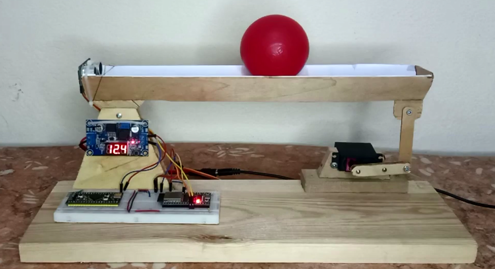
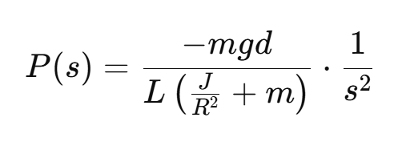
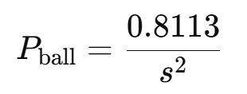
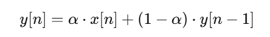

# Balancing Ball Project

<p align="center">
  
</p>

## Table of Contents
1. [Introduction](#introduction)
2. [Modeling and Transfer Function](#modeling-and-transfer-function)
3. [PID Control Code](#pid-control-code)
4. [Implementation of Low-Pass Filter](#implementation-of-low-pass-filter)
5. [Low-Pass Filter with Derivative Part](#low-pass-filter-with-derivative-part)
6. [Low-Pass Filter with Servo](#low-pass-filter-with-servo)
7. [Clamping Saturation Error](#clamping-saturation-error)
---

## Introduction

This project involves designing a **Balancing Ball System** on an STM32F401 microcontroller, utilizing a PID controller to keep the ball at a desired position on a tilting beam. The system integrates ultrasonic sensors for distance measurement, a servo for beam control, and filtering to ensure smooth operation and minimize vibrations. The project's primary goal is to stabilize the ball by controlling its position using real-time feedback.

## Modeling and Transfer Function

To control the ball’s position, we first modeled the system dynamics. Starting from the physical parameters:
<p align="center">
  
</p>
- **Mass of the ball (m)**: 0.0065 kg
- **Radius of the ball (R)**: 0.034 m
- **Gravity (g)**: 9.8 m/s²
- **Beam length (L)**: 0.302 m
- **Distance from pivot (d)**: 0.035 m
-  **Moment of Inertia (J):** 3.0056 × 10<sup>-6</sup> kg·m²

The resulting transfer function was derived and analyzed to assess system stability:

<p align="center">
  
</p>
And the final transfer function after substitution  is : 

<p align="center">
  
</p>

The step response of opened-loop :

<p align="center">
  
</p>
This transfer function was then visualized using a step response plot to validate the system's stability and response characteristics.

## PID Control Code

The **PID controller** was implemented to adjust the beam angle, ensuring the ball remains at the target position. Key PID parameters (\(Kp\), \(Ki\), \(Kd\)) were tuned to balance the system effectively.

```c
FUNCTION Balance()
    // Get the current distance from the sensor
    distance = GetDistance()

    // Handle error in the ultrasonic sensor reading
    IF distance > 32 OR distance < 0
        distance = prevDistance
    END IF

    // Calculate the error and change in error
    error = distance - REFERENCE_POS
    dError = error - prevError
    
    // Proportional term (P)
    P = error
    
    // Integral term (I)
    I = I + (error * dt)
    
    // Low-pass filter applied to derivative error (dError)
    dError = LowPassFilter(dError, prev_dError, 0.2)
    
    // Derivative term (D)
    D = dError / dt

    // Calculate servo angle using PID control
    servoAngle = Kp * P + Ki * I + Kd * D

    // Apply low-pass filter to servo angle
    servoAngle = LowPassFilter(servoAngle, prevServoAngle, 0.3)

    // Move the servo to the new angle
    Servo(servoAngle)

    // Clamping saturation error
    IF (prevServoAngle is same sign as servoAngle) AND (servoAngle / distance > 0) AND (servoAngle > 60 OR servoAngle < -45)
        I = 0  // Disable the integrator
    END IF

    // Update previous values for the next iteration
    prevError = error
    prev_dError = dError
    prevDistance = distance
    prevServoAngle = servoAngle
END FUNCTION
```

Within each control loop, the **PID algorithm** computes the error, integral, and derivative components. The calculated output then drives the servo motor, correcting the beam angle to stabilize the ball.

The step response of closed-loop at Kp=3 , Ki=1 and Kd=1.5 :

<p align="center">
  
</p>

## Implementation of Low-Pass Filter

To address measurement noise, a **low-pass filter (LPF)** was implemented. This filter smooths sudden spikes or fluctuations in the sensor readings, thereby enhancing the stability of the control system.

The LPF formula used is:


<p align="center">
  
</p>


```c
FUNCTION LowPassFilter(input, prev_output, alpha)
    // Calculate the new output using the low-pass filter formula
    output = (alpha * input) + ((1 - alpha) * prev_output)

    // Return the new output along with the updated previous output
    RETURN output
END FUNCTION
```

The `alpha` value was selected based on the desired cutoff frequency, balancing responsiveness and stability.
Certainly! Here’s the section presented as pseudocode in Markdown:

## Low-Pass Filter with Derivative Part

Incorporating the LPF with the **derivative term** in the PID controller minimizes noise amplification. Without filtering, derivative action can amplify sensor noise, leading to unstable system behavior. Here’s how the derivative part is filtered:

```c
D = (error - prevError) / dt;
D = low_pass_filter(D, 0.2);  // 0.2 is the alpha value for filtering
```

By applying the LPF, we mitigate the effects of sensor noise on the derivative term, ensuring smoother and more controlled servo movements.

## Low-Pass Filter with Servo

The **servo motor** directly responds to the PID output, which includes the LPF-filtered signal. This setup reduces abrupt movements and potential vibrations, preventing excessive oscillations of the beam.

```c
servoAngle = Kp * P + Ki * I + Kd * D;
servoAngle = low_pass_filter(servoAngle, 0.2);  // Smoothing the servo command
Servo(servoAngle);
```

By applying LPF directly to the servo command, we ensure that the beam adjustments are gradual, contributing to overall system stability and performance.

## Clamping Saturation Error

To handle the servo motor's saturation limits and prevent integrator windup in the PID control, the following pseudocode demonstrates a clamping mechanism. This checks if the output is saturated and disables the integrator if saturation is detected under specific conditions.

```plaintext
// Pseudocode: Clamping saturation error in PID controller

IF (servo angle == previous servo angle) AND
   (servo angle / distance > 0) AND
   (servo angle > 60 OR servo angle < -45) THEN
   
   SET integral term to 0  // Disable integrator to avoid windup
END IF
```

**Explanation:**
1. **Condition 1**: Check if the servo angle has reached the same value as in the previous loop, suggesting a potential saturation.
2. **Condition 2**: Ensure the servo angle and distance error have the same sign, indicating further correction in the same direction would be unnecessary.
3. **Condition 3**: Confirm if the servo angle has exceeded predefined bounds (between -45 and 60 degrees).

By setting the integral term to zero when these conditions are met, this approach reduces unnecessary corrective action, stabilizing the response of the control system.

## References
[Understanding PID (Matlab Teck Talks)](https://www.youtube.com/watch?v=wkfEZmsQqiA&list=PLn8PRpmsu08pQBgjxYFXSsODEF3Jqmm-y)

[Control Tutorial : Ball & Beam](https://ctms.engin.umich.edu/CTMS/index.php?example=BallBeam&section=SystemModeling)


---
This documentation structure should be a good starting point for conveying the technical depth and functionalities of the project.